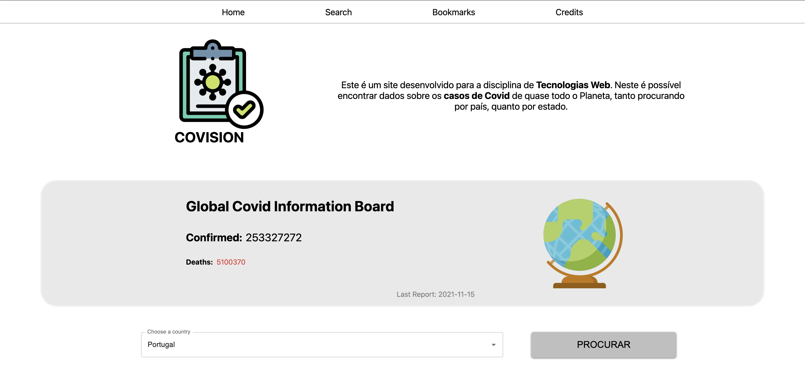
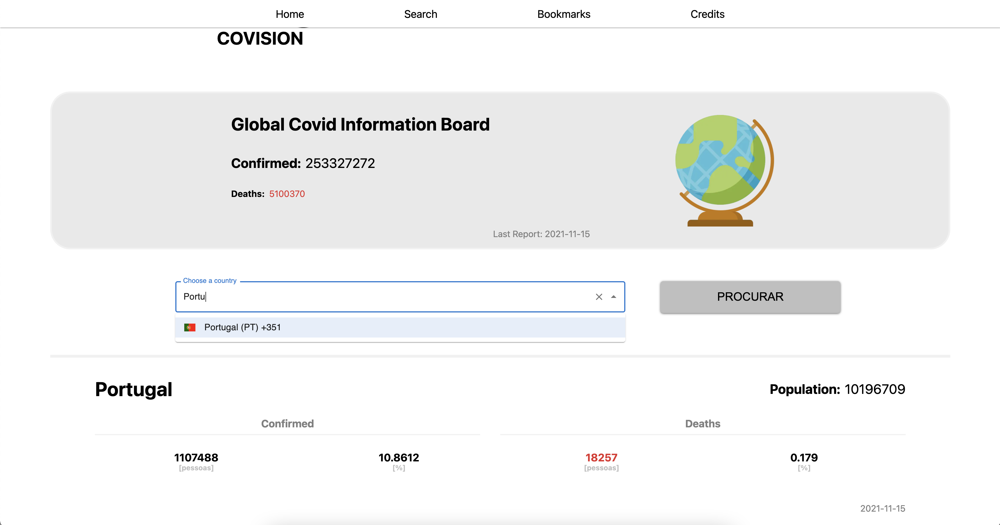
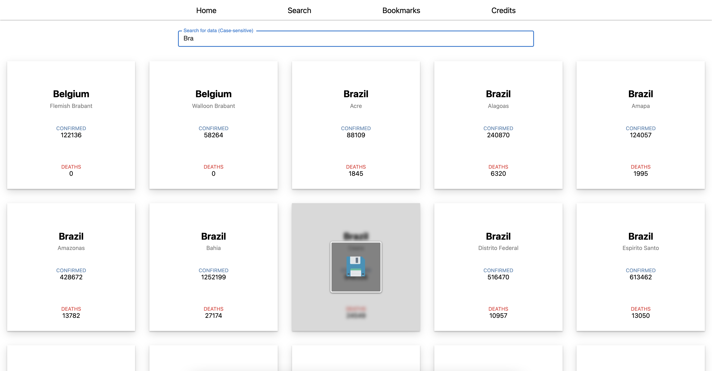
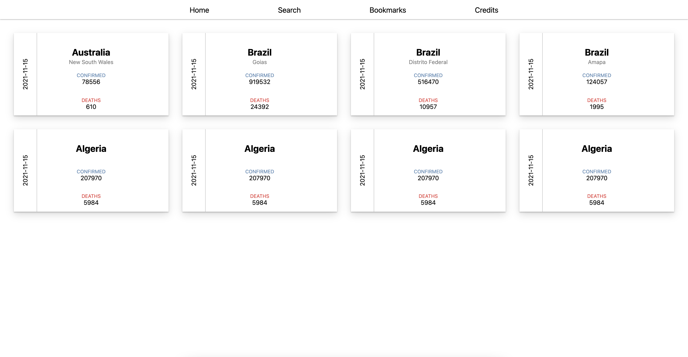

<h1>
  <strong>Projeto 1-B - TechWeb</strong>
</h1>
  
## Autor: 
  
<table>
  <tr>
    <td align="center"><a href="https://github.com/fran-janela"> <b>Francisco Pinheiro Janela</b></a> </td>
    </tr>
</table>
    
  
## Deploy da aplicação:
  

para acessar o aplicativo <a href="https://covision-app.herokuapp.com/">clique aqui</a>.  

Ou acesse o link abaixo:

<a href="https://covision-app.herokuapp.com/">https://covision-app.herokuapp.com/</a>
  

O backend não possui interface, porém seu link é: https://covision-backend.herokuapp.com/api/bookmarks/

    

## O que foi feito:

- [x] Backend Django Rest Framework
- [x] Frontend Next.js
- [x] Deploy da aplicação no Heroku (Frontend e Backend)
- [x] Uma Dashboard que apresenta os dados de Covid globais e onde é possível procurar por dados de países específicos
- [x] Uma área de busca para países e regiões capaz de salvar dados no backend para posterior avaliação

## Adicionais:

- [x] Tela de Loading customizada para esperar o fetch da API
- [x] Um dropdown Autocomplete para os países.
- [x] Uma comparação em porcentagem dos dados de Covid com o total da população do país (API de população mundial - diferente da API de casos de Covid).
- [x] Capacidade de deletar bookmarks feitos.
- [x] Estilizado com css e funções de javaScript

# Imagens de Exemplo

Tela Dashboard:

Tela Dashboard com país pesquisado e demonstração de autocomplete:

Menu de Search com Hover para salvar um dado:

Pagina de Bookmarks salvos pelo usuário:

  Insper - 4ºComp

